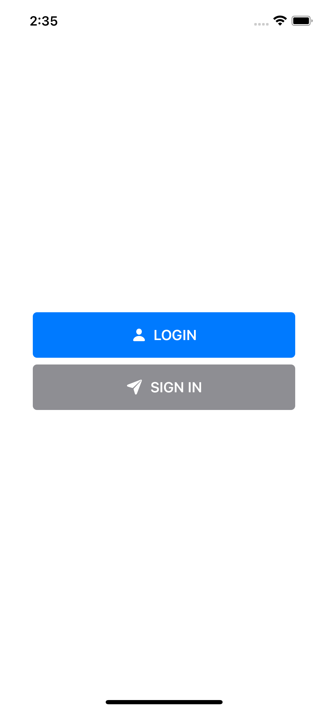

    

#

CMLoadingButton is simple loading button with animation. Made in Pure SwiftUI

- [Screenshots](#screenshots)
- [Requirements](#requirements)
- [Installation](#installation)
    - [Swift Package Manager](#swiftpackagemanager)
- [Usage](#usage)
- [Todo](#todo)
- [Author](#author)
- [License](#license)

## ScreenShots

## Requirements
* Xcode 11+
* SwiftUI
* iOS 14+

## Installaion
### Swift Package Manager(SPM)
    File ➜ Swift Packages ➜ Add Package Dependancy..

## Usage

## TODO
- [ ] End animation(normal, Shake, expand)
- [ ] Support gradient background color

## Author
Byun Kyung Min ➜ bkm.change.min@gmail.com

## License

CMLoadingButton is available under the MIT license. See the `LICENSE` file for more info.