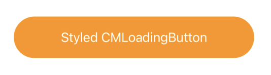

<p align="center">
 </a>
</p>

<h3 align="center">🔄 SwiftUI LoadingButton 🔄</h3>

<div align="center">


</div>

---

<p align="center"> 
    Simple Loading Animation Button for SwiftUI
    <br> 
</p>

## 📹 Preview

<p align="center">
    
</p>

## 🏁 Getting Started

### Requirements
* Xcode 11+
* SwiftUI
* iOS 14+
* macOS 10.15+

### Installaion
#### Swift Package Manager(SPM)
    File ➜ Swift Packages ➜ Add Package Dependancy..

```Swift
.package(url: "https://github.com/Changemin/LoadingButton", from: "1.1.1")
```

## 🎈Usage
```Swift
LoadingButton(action: { }, isLoading: <Binding>Bool, style: LoadingButtonStyle) {
    // View on the button
    // style is optional parameter
```
* `action` : Actions to do when button clicked
* `isLoading` : `<Binding>Bool` type. you can control loading status with this.
* `style`(Optional) : Custom style with `LoadingButtonStyle`

#### 🛠Custom Modifiers
```Swift
LoadingButtonStyle(width: CGFloat, 
                   height: CGFloat,
                   cornerRadius: CGFloat,
                   backgroundColor: Color,
                   loadingColor: Color,
                   strokeWidth: CGFloat,
                   strokeColor: Color)

// All of the parameter is optional
```
* `width`(Optional) : Width of button
* `height`(Optional) : Height of button
* `cornerRadius`(Optional) : Corner radius of button
* `backgroundColor`(Optional) : Background color of button
* `loadingColor`(Optional) : Background color of button when `Loading`, default is 50% opacity of `backgroundColor`
* `strokeWidth`(Optional) : Circle loading indicator stroke width
* `strokeColor`(Optional) : Circle loading indicator stroke Color(default: gray)

## Example
#### 👶 Simple
```Swift
import SwiftUI
import LoadingButton

struct ContentView: View {
    @State var isLoading: Bool = false
    
    var body: some View {
        LoadingButton(action: {
            // Your Action here
        }, isLoading: $isLoading) {
            Text("LoadingButton").foregroundColor(Color.white)
        }
    }
}
```
### Result


### 💅🏻 Applying Fully Custom Style
```Swift
import SwiftUI
import LoadingButton

struct ContentView: View {
    @State var isLoading: Bool = false
    var style = LoadingButtonStyle(width: 312,
                              height: 54,
                              cornerRadius: 27,
                              backgroundColor: .orange,
                              loadingColor: Color.orange.opacity(0.5),
                              strokeWidth: 5,
                              strokeColor: .gray)
    
    var body: some View {
        LoadingButton(action: {
            // Your Action here
        }, isLoading: $isLoading, style: style) {
            Text("Styled LoadingButton").foregroundColor(Color.white)
        }
    }
}
```
### Result



### 💅🏻 Styling Only Needs
```Swift
import SwiftUI
import LoadingButton

struct ContentView: View {
    @State var isLoading: Bool = false
    
    var body: some View {
        LoadingButton(action: {
            // Your Action here
        }, isLoading: $isLoading, style: LoadingButtonStyle(cornerRadius: 27, backgroundColor: .orange)) {
            Text("Styled LoadingButton").foregroundColor(Color.white)
        }
    }
}
```
### Same Result


## ✅ TODO
- [ ] End animation(normal, shake(when fail), expand)
- [ ] Support gradient background color

## 📜 License

LoadingButton is available under the MIT license. See the `LICENSE` file for more info.

## ✍️ Author

- Byun Kyung Min ➜ [🇰🇷@Changemin](https://github.com/Changemin)
