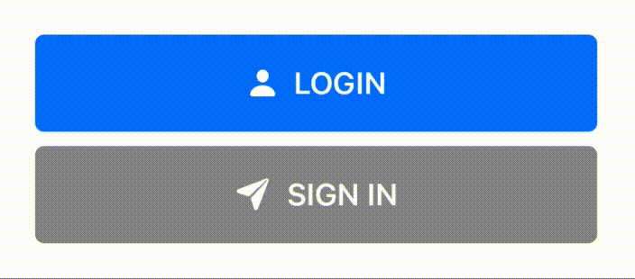

<p align="center">
    

<p>CMLoadingButton is simple loading button with animation. Made with pure SwiftUI</p>
</p>

## ScreenShots


## Requirements
* Xcode 11+
* SwiftUI
* iOS 14+

## Installaion
### Swift Package Manager(SPM)
    File ➜ Swift Packages ➜ Add Package Dependancy..

## Usage
```Swift
CMLoadingButton(action: { }, isLoading: <Binding>Bool, style: CMButtonStyle) {
    // View on the button
    // style is optional parameter
}
```
* `action` : Actions to do when button clicked
* `isLoading` : `<Binding>Bool` type. you can control loading status with this.
* `style`(Optional) : Custom style with `CMButtonStyle`

#### Custom Style
```Swift
CMButtonStyle(width: CGFloat, 
              height: CGFloat,
              cornerRadius: CGFloat,
              backgroundColor: Color,
              loadingColor: Color,
              strokeWidth: CGFloat,
              strokeColor: Color)

// All of the parameter is optional
```
* `width`(Optional) : Width of button
* `height`(Optional) : Height of button
* `cornerRadius`(Optional) : Corner radius of button
* `backgroundColor`(Optional) : Background color of button
* `loadingColor`(Optional) : Background color of button when `Loading`, default is 50% opacity of `backgroundColor`
* `strokeWidth`(Optional) : Circle loading indicator stroke width
* `strokeColor`(Optional) : Circle loading indicator stroke Color(default: gray)
## Example
### Simple
```Swift
import SwiftUI
import CMLoadingButton

struct ContentView: View {
    @State var isLoading: Bool = false
    
    var body: some View {
        CMLoadingButton(action: {
            // Your Action here
        }, isLoading: $isLoading) {
            Text("CMLoadingButton").foregroundColor(Color.white)
        }
    }
}
```
### Result


### Applying Fully Custom Style
```Swift
import SwiftUI
import CMLoadingButton

struct ContentView: View {
    @State var isLoading: Bool = false
    var style = CMButtonStyle(width: 312,
                              height: 54,
                              cornerRadius: 27,
                              backgroundColor: .orange,
                              loadingColor: Color.orange.opacity(0.5),
                              strokeWidth: 5,
                              strokeColor: .gray)
    
    var body: some View {
        CMLoadingButton(action: {
            // Your Action here
        }, isLoading: $isLoading, style: style) {
            Text("Styled CMLoadingButton").foregroundColor(Color.white)
        }
    }
}
```
### Result


### Appling Style Only Needs
```Swift
import SwiftUI
import CMLoadingButton

struct ContentView: View {
    @State var isLoading: Bool = false
    
    var body: some View {
        CMLoadingButton(action: {
            // Your Action here
        }, isLoading: $isLoading, style: CMButtonStyle(cornerRadius: 27, backgroundColor: .orange)) {
            Text("Styled CMLoadingButton").foregroundColor(Color.white)
        }
    }
}
```
### Same Result


## TODO
- [ ] End animation(normal, shake(when fail), expand)
- [ ] Support gradient background color

## Author
Byun Kyung Min ➜ bkm.change.min@gmail.com

## License

CMLoadingButton is available under the MIT license. See the `LICENSE` file for more info.